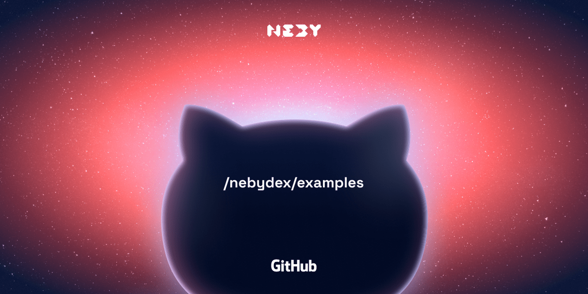

# Neby Examples

This repository contains example code samples demonstrating the usage of Neby. These examples serve as practical references and starting points for developers working with the Neby ecosystem.

## Setup Examples

### 1. Clone Repository

```bash
git clone https://github.com/NebyDex/examples.git
```

### 2. Install

```bash
npm install
```

### 3. Build

```bash
npm run build
```

### 4. Run Example

#### Running get-qoute

```bash
npm run get-quote
```

#### Running router-swap

_Make sure you change your private key in the example and rebuild the project_

```bash
npm run router-swap
```

#### Running pool-tvl

```bash
npm run pool-tvl
```
